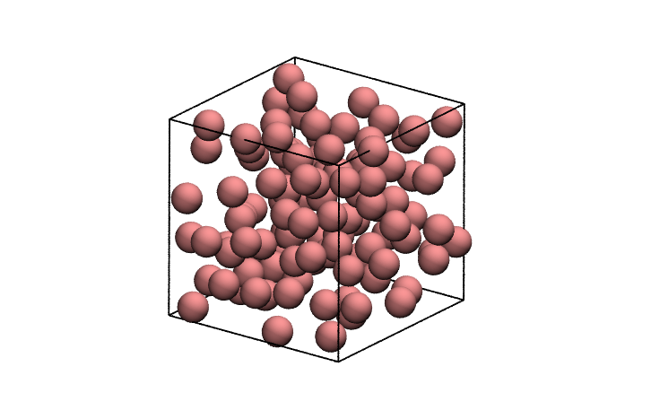

# Lennard Jones MD Simulator in C++

This program simulates "Lennard-Jonseium". It's mainly a tool for learning and
study, so don't go and use it for any kind of official research or anything (or
do so at your own risk). Expect bugs and mistakes.

The code is written in C++ and requires Boost (for .ini file) and libxdrfile
(for writing trajectory to .xtc). Some of the classes I use are based on my
[libgmxcpp](https://github.com/wesbarnett/libgmxcpp) library.

Although I have parallelized some of the for loops with OpenMP, expect this
program to be slow!

Current features:

* NVE
* NVT (with Andersen)
* Calculate RDF
* Calculate velocity distribution
* Block error analysis (only on temperature, KE, and PE currently)

Check out 'md.ini' for some of the features. When you run the program all of the
options are printed to the screen, including ones you did not specify in the .ini
file.

Reduced units are used. When running the program an initial configuration of
atoms is generated by randomly inserting them into the box according to the
specified density, ensuring that the atoms are not too close to each other.

To compile simply do:

    make

To run do:

    ./md md.ini

See Frenkel and Smit's *Understanding Molecular Simulation* as well as Allen and
Tildesley's *Computer Simulations of Liquids*.

